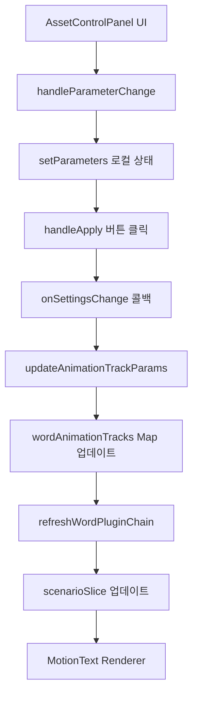
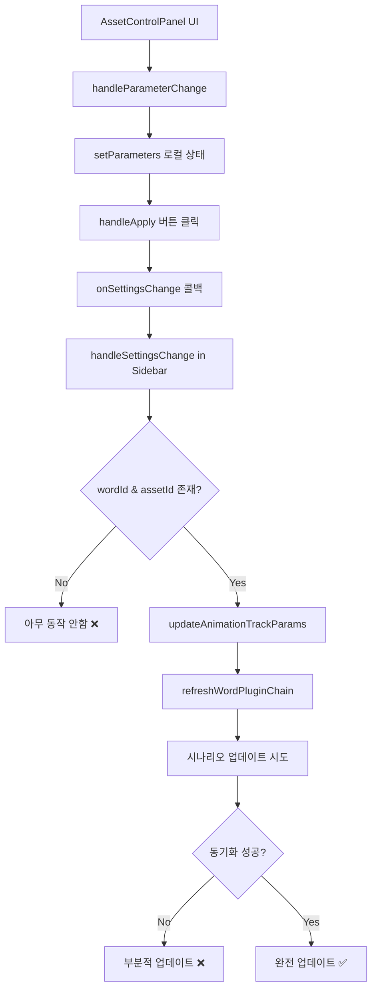

# Animation Asset System Bug Analysis and Refactoring Plan

이 문서는 ECG Frontend의 애니메이션 에셋 시스템에서 발견된 버그들과 재정비 계획을 상세히 분석합니다.

## 📋 목차

1. [현재 구현 문제점 분석](#현재-구현-문제점-분석)
2. [문서와 실제 코드 차이점](#문서와-실제-코드-차이점)
3. [상세 버그 목록](#상세-버그-목록)
4. [리팩토링 우선순위](#리팩토링-우선순위)
5. [개선된 아키텍처 제안](#개선된-아키텍처-제안)
6. [구체적 수정 계획](#구체적-수정-계획)

## 🔍 현재 구현 문제점 분석

### 1. **파라미터 업데이트 플로우 불완전**

#### 문제점:

```typescript
// AssetControlPanel.tsx:192-194
const handleApply = () => {
  onSettingsChange?.(parameters as AssetSettings)
}
```

#### 분석:

- `onSettingsChange` 콜백이 전달되지만 실제 `updateAnimationTrackParams` 호출이 불안정
- 파라미터 변경이 시나리오에 반영되지 않는 경우 발생
- 사용자가 설정을 변경해도 실제 애니메이션에 적용되지 않음

### 2. **상태 동기화 문제**

#### 현재 상태:

- **WordSlice.wordAnimationTracks**: 메인 애니메이션 데이터
- **ClipSlice.clips[].words[].animationTracks**: UI 표시용 미러 데이터
- **ScenarioSlice.currentScenario**: 렌더링용 시나리오

#### 문제점:

```typescript
// wordSlice.ts:822-859에서 파라미터 업데이트 시
updateAnimationTrackParams: (wordId, assetId, partialParams) => {
  // 1. wordAnimationTracks 업데이트 ✅
  // 2. refreshWordPluginChain 호출 ✅
  // 3. 클립 데이터 동기화 ❌ (가끔 실패)
}
```

### 3. **AssetControlPanel 연결 문제**

#### 현재 구현:

```typescript
// AnimationAssetSidebar/index.tsx:68-81
const handleSettingsChange = (settings: Record<string, unknown>) => {
  const store = useEditorStore.getState() as any
  const wordId = store.focusedWordId || store.selectedWordId
  const assetId = expandedAssetId

  if (wordId && assetId) {
    store.updateAnimationTrackParams?.(wordId, assetId, settings)
    store.refreshWordPluginChain?.(wordId)
  }
}
```

#### 문제점:

- `focusedWordId`와 `selectedWordId` 우선순위 불분명
- 에러 처리 없음
- 파라미터 타입 검증 없음

### 4. **플러그인 키 관리 복잡성**

#### 현재 로직:

```typescript
// AssetControlPanel.tsx:52-72
useEffect(
  () => {
    const resolveFromDatabase = async () => {
      if (pluginKeyFromStore) return // 이미 있으면 패스

      // assets-database.json에서 fallback 검색
      const res = await fetch('/asset-store/assets-database.json')
      const data = await res.json()
      const match = data.assets?.find(/* ... */)
      if (match?.pluginKey) setFallbackPluginKey(match.pluginKey)
    }
    resolveFromDatabase()
  },
  [
    /* dependencies */
  ]
)
```

#### 문제점:

- Database fallback이 과도하게 복잡
- 동일한 데이터를 여러 소스에서 관리
- Store와 DB 간 우선순위 불분명

## 📊 문서와 실제 코드 차이점

### 1. **예상 플로우 vs 실제 플로우**

#### 문서의 예상 플로우:



#### 실제 플로우:



### 2. **누락된 구현**

#### 예상된 기능:

- 실시간 파라미터 미리보기
- 파라미터 검증 및 에러 처리
- 다중 선택 단어 일괄 파라미터 적용

#### 실제 구현:

- 파라미터 변경 후 "적용" 버튼 클릭해야 반영
- 에러 처리 없음
- 다중 선택 단어 파라미터 적용 불가

## 🐛 상세 버그 목록

### 🔴 Critical (즉시 수정 필요)

#### Bug #1: 파라미터 변경이 시나리오에 반영되지 않음

**재현 시나리오:**

1. 단어 선택 → 애니메이션 적용
2. 트랙 클릭 → AssetControlPanel 열림
3. 파라미터 조정 → "적용" 버튼 클릭
4. 실제 애니메이션에 변경사항 반영되지 않음

**원인:**

```typescript
// scenarioSlice.ts:85-157의 refreshWordPluginChain에서
refreshWordPluginChain: (wordId) => {
  // ... 생략
  const pluginChain = tracks.map((t) => ({
    name: t.pluginKey.split('@')[0],
    params: t.params || {}, // ← 이 params가 업데이트되지 않음
    // ...
  }))
}
```

#### Bug #2: `focusedWordId` vs `selectedWordId` 충돌

**재현 시나리오:**

1. 단어 A 선택 (selectedWordId = A)
2. 단어 B 포커스 (focusedWordId = B)
3. 파라미터 변경 시 어느 단어에 적용될지 불분명

**원인:**

```typescript
// AnimationAssetSidebar/index.tsx:73-75
const wordId = store.focusedWordId || store.selectedWordId
// focusedWordId가 우선이지만 사용자 의도와 다를 수 있음
```

### 🟡 High (주요 기능 영향)

#### Bug #3: 플러그인 매니페스트 로딩 실패 시 무한 로딩

**재현 시나리오:**

1. 네트워크 문제로 manifest.json 로드 실패
2. AssetControlPanel이 계속 로딩 상태

**원인:**

```typescript
// AssetControlPanel.tsx:128-146
try {
  const loadedManifest = await loadPluginManifest(pluginKey, options)
  setManifest(loadedManifest)
} catch (error) {
  console.error(`Failed to load manifest for ${pluginKey}:`, error)
  // setLoading(false) 누락 ❌
} finally {
  setLoading(false) // 여기서만 로딩 해제
}
```

#### Bug #4: 다중 트랙 파라미터 독립성 문제

**재현 시나리오:**

1. 단어에 여러 애니메이션 트랙 적용
2. 첫 번째 트랙 파라미터 변경
3. 모든 트랙에 동일한 파라미터 적용됨

### 🟢 Medium (사용성 문제)

#### Bug #5: ExpandedClipWaveform의 과도한 책임

**문제:**

- 파형 시각화 컴포넌트가 파라미터 업데이트 로직 포함
- `updateWordBaseTime`, `refreshWordPluginChain` 직접 호출

```typescript
// ExpandedClipWaveform.tsx:327-330
updateWordTiming(draggedWordId, newStart, currentTiming.end)
updateWordBaseTime?.(draggedWordId, newStart, currentTiming.end)
refreshWordPluginChain?.(draggedWordId)
setHasUnsavedChanges(true)
```

#### Bug #6: 에러 상황에서 UX 가이드 부족

**문제:**

- 플러그인 로드 실패 시 사용자에게 명확한 안내 없음
- 파라미터 타입 검증 실패 시 처리 없음

## 🎯 리팩토링 우선순위

### Phase 1: Critical Bug Fixes (1-2 days)

1. **파라미터 업데이트 플로우 수정**
   - `updateAnimationTrackParams` 안정화
   - `refreshWordPluginChain` 호출 보장

2. **상태 동기화 문제 해결**
   - 3개 데이터 소스 간 동기화 강화
   - 실패 시 복구 메커니즘 추가

### Phase 2: Architecture Improvements (3-4 days)

1. **컴포넌트 책임 분리**
   - ExpandedClipWaveform 리팩토링
   - 파라미터 업데이트 전용 훅 분리

2. **플러그인 키 관리 통합**
   - 단일 소스 관리 (wordAnimationTracks)
   - Database는 초기 로드만 담당

### Phase 3: UX & Performance (2-3 days)

1. **에러 처리 강화**
   - 사용자 친화적 에러 메시지
   - 자동 복구 메커니즘

2. **실시간 미리보기**
   - 파라미터 변경 즉시 반영
   - 디바운싱으로 성능 최적화

## 🏗️ 개선된 아키텍처 제안

### 1. **상태 관리 개선**

#### 현재 구조:

```typescript
// 분산된 상태 관리
WordSlice: wordAnimationTracks Map
ClipSlice: clips[].words[].animationTracks
ScenarioSlice: currentScenario.cues[].root.children[].pluginChain
```

#### 제안 구조:

```typescript
// 중앙화된 상태 관리
interface AnimationState {
  tracks: Map<string, AnimationTrack[]> // 단일 진실 공급원
  ui: Map<string, UIState> // UI 상태 분리
  scenario: RendererConfigV2 | null // 캐시된 시나리오
  version: number // 변경 감지용
}

// 동기화 보장 메커니즘
const syncToAllSources = (wordId: string, tracks: AnimationTrack[]) => {
  // 1. 메인 상태 업데이트
  updateWordAnimationTracks(wordId, tracks)

  // 2. 클립 데이터 동기화
  syncToClipData(wordId, tracks)

  // 3. 시나리오 갱신
  refreshScenario(wordId)

  // 4. UI 상태 업데이트
  updateUIState(wordId, tracks)
}
```

### 2. **컴포넌트 책임 재정의**

#### AssetControlPanel

- **역할**: 파라미터 UI 표시만 담당
- **책임 제거**: 직접적인 스토어 업데이트
- **개선**: 순수 Controlled Component로 변경

#### useAnimationParams 훅 신설

```typescript
const useAnimationParams = (wordId: string, assetId: string) => {
  const [params, setParams] = useState<Record<string, unknown>>({})
  const [isLoading, setIsLoading] = useState(false)
  const [error, setError] = useState<string | null>(null)

  const updateParams = useCallback(
    async (newParams: Record<string, unknown>) => {
      try {
        setIsLoading(true)

        // 1. 파라미터 검증
        await validateParams(assetId, newParams)

        // 2. 상태 업데이트
        await updateAnimationTrackParams(wordId, assetId, newParams)

        // 3. 시나리오 갱신
        await refreshWordPluginChain(wordId)

        setParams(newParams)
        setError(null)
      } catch (err) {
        setError(err.message)
      } finally {
        setIsLoading(false)
      }
    },
    [wordId, assetId]
  )

  return { params, updateParams, isLoading, error }
}
```

### 3. **에러 처리 개선**

```typescript
// 계층적 에러 처리
interface AnimationError {
  type: 'PLUGIN_LOAD_FAILED' | 'PARAM_VALIDATION_FAILED' | 'SYNC_FAILED'
  message: string
  recoverable: boolean
  recovery?: () => Promise<void>
}

const handleAnimationError = (error: AnimationError) => {
  switch (error.type) {
    case 'PLUGIN_LOAD_FAILED':
      showToast(
        '플러그인을 불러올 수 없습니다. 네트워크를 확인해주세요.',
        'error'
      )
      if (error.recoverable && error.recovery) {
        showRetryOption(error.recovery)
      }
      break

    case 'PARAM_VALIDATION_FAILED':
      showToast('잘못된 파라미터 값입니다.', 'warning')
      // 이전 값으로 복원
      break

    case 'SYNC_FAILED':
      showToast('변경사항을 저장하는 중 오류가 발생했습니다.', 'error')
      // 자동 재시도
      break
  }
}
```

## 🔧 구체적 수정 계획

### 1. **AssetControlPanel 수정**

#### Before:

```typescript
const handleApply = () => {
  onSettingsChange?.(parameters as AssetSettings)
}
```

#### After:

```typescript
const handleApply = async () => {
  if (!onSettingsChange) return

  try {
    setApplying(true)
    await onSettingsChange(parameters as AssetSettings)
    showToast('설정이 적용되었습니다.', 'success')
    onClose?.()
  } catch (error) {
    showToast('설정 적용 중 오류가 발생했습니다.', 'error')
    console.error('Failed to apply settings:', error)
  } finally {
    setApplying(false)
  }
}
```

### 2. **AnimationAssetSidebar 수정**

#### Before:

```typescript
const handleSettingsChange = (settings: Record<string, unknown>) => {
  const store = useEditorStore.getState() as any
  const wordId = store.focusedWordId || store.selectedWordId
  const assetId = expandedAssetId

  if (wordId && assetId) {
    store.updateAnimationTrackParams?.(wordId, assetId, settings)
    store.refreshWordPluginChain?.(wordId)
  }
}
```

#### After:

```typescript
const handleSettingsChange = async (settings: Record<string, unknown>) => {
  const store = useEditorStore.getState()

  // 명확한 wordId 결정 로직
  const wordId = determineTargetWordId(store)
  const assetId = expandedAssetId

  if (!wordId || !assetId) {
    throw new Error('애니메이션을 적용할 단어를 선택해주세요.')
  }

  // 파라미터 검증
  await validateAnimationParams(assetId, settings)

  // 원자적 업데이트 (all or nothing)
  await store.updateAnimationTrackParamsAtomic(wordId, assetId, settings)
}

const determineTargetWordId = (store: EditorStore): string | null => {
  // 1. 확장된 클립의 포커스된 단어 우선
  if (store.expandedWordId) return store.expandedWordId

  // 2. 명시적으로 포커스된 단어
  if (store.focusedWordId) return store.focusedWordId

  // 3. 선택된 단어 (다중 선택이 아닐 때만)
  if (store.multiSelectedWordIds.size === 1) {
    return Array.from(store.multiSelectedWordIds)[0]
  }

  return null
}
```

### 3. **WordSlice 개선**

#### 새로운 원자적 업데이트 메서드:

```typescript
updateAnimationTrackParamsAtomic: async (
  wordId: string,
  assetId: string,
  params: Record<string, unknown>
) => {
  const transaction = createTransaction()

  try {
    // 1. 백업 생성
    const backup = get().createBackup(wordId)

    // 2. wordAnimationTracks 업데이트
    await transaction.updateTracks(wordId, assetId, params)

    // 3. 클립 데이터 동기화
    await transaction.syncClipData(wordId)

    // 4. 시나리오 갱신
    await transaction.refreshScenario(wordId)

    // 5. 트랜잭션 커밋
    await transaction.commit()
  } catch (error) {
    // 롤백
    await transaction.rollback(backup)
    throw error
  }
}
```

### 4. **에러 바운더리 추가**

```typescript
const AnimationErrorBoundary: React.FC<{ children: React.ReactNode }> = ({ children }) => {
  return (
    <ErrorBoundary
      FallbackComponent={AnimationErrorFallback}
      onError={(error, errorInfo) => {
        console.error('Animation system error:', error, errorInfo)
        // Sentry 등으로 에러 리포팅
      }}
    >
      {children}
    </ErrorBoundary>
  )
}

const AnimationErrorFallback: React.FC<{ error: Error; resetError: () => void }> = ({
  error,
  resetError
}) => (
  <div className="p-4 bg-red-50 border border-red-200 rounded-lg">
    <h3 className="text-red-800 font-medium">애니메이션 시스템 오류</h3>
    <p className="text-red-600 text-sm mt-1">{error.message}</p>
    <button
      onClick={resetError}
      className="mt-2 px-3 py-1 bg-red-600 text-white rounded text-sm"
    >
      다시 시도
    </button>
  </div>
)
```

## 📋 테스트 계획

### 1. **단위 테스트**

- `updateAnimationTrackParams` 동작 검증
- `refreshWordPluginChain` 시나리오 생성 확인
- 파라미터 검증 로직 테스트

### 2. **통합 테스트**

- AssetControlPanel → Store → Scenario 전체 플로우
- 다중 트랙 파라미터 독립성 확인
- 에러 상황에서 상태 일관성 검증

### 3. **E2E 테스트**

- 사용자 시나리오별 테스트
- 파라미터 변경 → 실제 애니메이션 반영 확인
- 네트워크 오류 상황 처리 검증

## 🚀 구현 로드맵

### Week 1: Critical Fixes

- [ ] 파라미터 업데이트 플로우 수정
- [ ] 상태 동기화 문제 해결
- [ ] 기본 에러 처리 추가

### Week 2: Architecture Improvements

- [ ] useAnimationParams 훅 구현
- [ ] 컴포넌트 책임 분리
- [ ] 원자적 업데이트 메커니즘

### Week 3: Polish & Testing

- [ ] 에러 바운더리 추가
- [ ] 사용자 경험 개선
- [ ] 종합 테스트 및 버그 수정

이 계획을 통해 안정적이고 확장 가능한 애니메이션 에셋 시스템을 구축할 수 있을 것입니다.
