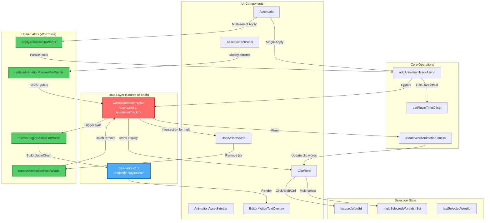
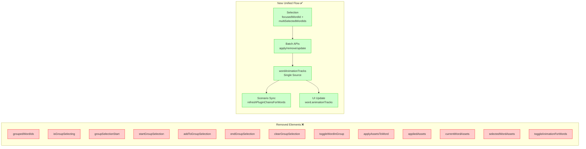
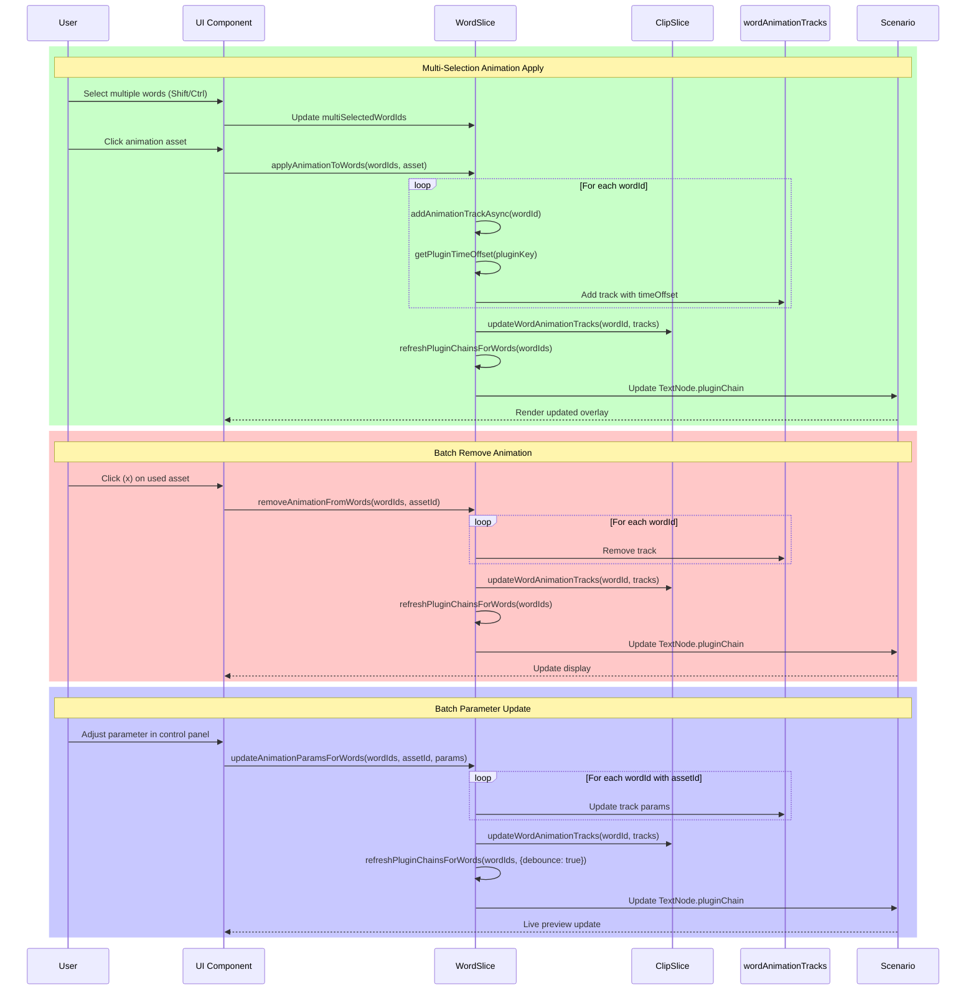

# Editor Word Selection & Animation — Unified Redesign Plan (즉시 전환)

목표: 단어(ClipWord = TextNode) 선택/애니메이션 관리 흐름을 단일 파이프라인으로 일원화. Word-레벨에서의 그룹 드래그는 제거(그룹 드래그는 상위 ClipWords 리스트에서만 사용). 점진 폐기 없이 즉시 전환합니다.

## 철학(단일 관리 흐름)

- ClipWord(TextNode) ↔ AnimationTrack, AnimationTrack ↔ TextNode.pluginChain(Scenario v2.0) 1:1 매핑.
- AnimationTrack 수정 시마다 시나리오 pluginChains 동기화(증분/디바운스).
- ClipWord 옆 플러그인 아이콘은 AnimationTrack 기준으로 표시.
- 사운드 웨이브 편집 화면은 AnimationTrack을 읽어 애니메이션 적용 상태를 반영.

## 멀티선택 동작 원칙

- 적용중 카드 노출: 다중 선택된 모든 단어가 특정 에셋을 “전부” 보유할 때만 상단 “적용중” 카드로 노출. ‘x’ 제거 시 전체에서 제거(일괄).
- 다중 적용: 멀티 선택 상태에서 애니메이션 적용 시 모든 단어에 동일 에셋을 추가(반복 처리).
- 파라미터 일괄 수정: 멀티 선택 상태에서도 에셋별 파라미터 수정 가능. 파라미터는 baseTime과 독립.

---

## 아키텍처 개편 개요(즉시 전환)

- 단일 소스: `wordAnimationTracks: Map<wordId, AnimationTrack[]>`를 진리원천으로 유지.
- 단어 데이터 미러링: `clip.words[*].animationTracks`는 UI/백업 싱크용(읽기 최적화). `appliedAssets`는 즉시 제거.
- 시나리오 업데이트: `refreshWordPluginChain(wordId)` → 다중 단어 지원 `refreshPluginChainsForWords(wordIds, {debounce})`로 확장.
- 시간 오프셋: 단일/다중 적용 모두 `getPluginTimeOffset(pluginKey)`를 거쳐 Track에 `timeOffset` 저장. `initialScenario.ts`의 DOM lifetime 계산과 일관.

## 데이터 모델(정리)

- AnimationTrack
  - 필수: `assetId`, `assetName`, `pluginKey?`, `timing {start,end}`, `intensity {min,max}`, `color`, `timeOffset?`, `params?`
  - timing은 Word의 `start/end`를 초기값으로 하되, 개별 트랙에서 조정 가능.
- Selection State(통합)
  - Word: `focusedWordId`, `multiSelectedWordIds(Set)`, `lastSelectedWordId/ClipId`
  - 그룹 드래그 관련 단어-레벨 상태 제거: `groupedWordIds`, `isGroupSelecting`, `groupSelectionStart` 등
  - Clip-레벨 그룹 드래그는 별도(ClipTable/ClipList)에서 유지.

## Store/API 리팩터(즉시 전환)

1. WordSlice 정리

- 제거: `startGroupSelection/addToGroupSelection/endGroupSelection/clearGroupSelection/toggleWordInGroup`, `groupedWordIds`, `isGroupSelecting`, `groupSelectionStart`.
- 선택 통합: 드래그 가능 여부 `canDragWord`는 `focusedWordId` 또는 `multiSelectedWordIds.has(wordId)` 기준으로 간소화.
- 멀티 토글 → 일괄 API 제공:
  - `applyAnimationToWords(wordIds, asset)` — 전원 미보유 시 추가(개별 `addAnimationTrackAsync` 병렬), 일부 보유/일부 미보유일 때는 옵션화(토글/강제적용/강제해제). 기본은 “강제적용”.
  - `removeAnimationFromWords(wordIds, assetId)` — 일괄 제거.
  - `updateAnimationParamsForWords(wordIds, assetId, partialParams)` — 일괄 파라미터 갱신.
- 시나리오 갱신: `refreshPluginChainsForWords(wordIds, { silent?: boolean })` — 내부적으로 단어별 `refreshWordPluginChain`을 디바운스/배치 처리.
- 삭제 UX: `deleteSelectedWords()` 조건을 `>= 1`로 완화(현재 `> 1`).

2. ClipSlice 동기화 포인트 정리

- 유지: `updateWordAnimationTracks` — 단, 호출은 WordSlice 일괄 API에서만 하도록 규율(컴포넌트 직접 호출 금지).
- 제거: `applyAssetsToWord` 및 `appliedAssets` 관련 모든 코드 제거.
- 아이콘 표시 소스: `word.animationTracks`만 사용.

3. UISlice 정리(충돌 최소화)

- 즉시 제거: `currentWordAssets`, `selectedWordAssets`.
- 유지: `selectedWordId`(UI 포커스용 최소 상태) — 가능한 빠르게 사용처를 `focusedWordId`/`multiSelectedWordIds`로 대체 후 제거 검토.
- 모든 UI 파생은 `wordAnimationTracks`/`word.animationTracks`로부터 직접 계산.

## 컴포넌트 업데이트(주요 지점)

- ClipWord.tsx
  - 클릭 로직 유지(Shift 범위/Ctrl 토글/더블클릭 편집). 그룹 드래그 관련 브랜치 삭제.
  - 편집 상태 클래스 오타 수정: `bg-yel` → 올바른 색상 클래스.
- ClipWords.tsx
  - `useWordGrouping` 제거. 드래그 그룹 피드백/권한 판단은 `multiSelectedWordIds` 기반.
  - 아이콘 렌더링은 `word.animationTracks` 기준으로 재구성.
- AnimationAssetSidebar
  - AssetGrid: 멀티선택 시 `applyAnimationToWords(...)` 호출. 단일 시 `addAnimationTrackAsync(...)` 유지.
  - UsedAssetsStrip: “적용중 에셋”은 선택된 모든 단어가 보유한 에셋만 노출. ‘x’는 `removeAnimationFromWords(...)` 호출.
  - AssetControlPanel: 멀티선택 시 `updateAnimationParamsForWords(...)`로 일괄 파라미터 변경 허용.

## 시나리오/렌더러 동기화

- 모든 트랙 추가/제거/수정 후 `refreshPluginChainsForWords` 호출.
- `initialScenario.ts`의 DOM lifetime 계산은 Track의 `timeOffset`을 활용하므로, 멀티 적용 경로에서도 `timeOffset`을 반드시 설정.
- EditorMotionTextOverlay는 기존 `scenarioVersion` 디바운스 갱신 흐름 유지.

## 상호작용 규칙(정의)

- 멀티선택의 “적용중” 판단: 교집합(intersection) 방식.
  - `intersectionAssets = ∩(각 단어의 assetId 집합)`
  - 상단 “적용중”에는 `intersectionAssets`만 표기.
- 멀티 적용 기본 동작: 강제 적용(모두 추가). 옵션으로 토글/강제 해제 모드도 지원 가능.
- 파라미터 일괄 변경: 선택된 단어들 중 해당 에셋을 가진 트랙에만 적용(미보유 단어는 무시).

## 전환 절차(즉시 적용)

- WordSlice: 그룹 선택/상태 전부 제거 → 일괄 API(`applyAnimationToWords/removeAnimationFromWords/updateAnimationParamsForWords/refreshPluginChainsForWords`) 추가 → `toggleAnimationForWords` 폐기.
- ClipSlice: `applyAssetsToWord` 제거, `updateWordAnimationTracks`만 사용하도록 정리. `appliedAssets` 모든 참조 삭제.
- UISlice: `currentWordAssets/selectedWordAssets` 제거, 사용처를 `word.animationTracks`/`wordAnimationTracks`로 대체.
- 컴포넌트: `useWordGrouping` 제거. AssetGrid/UsedAssetsStrip는 새 일괄 API로 교체. ClipWord 스타일 오타 수정.
- 키 처리: Delete/Backspace 최소 1개 선택 시 삭제 동작.
- 시나리오: 멀티/단일 경로 모두 `getPluginTimeOffset` 적용 후 `refreshPluginChainsForWords` 호출.

## 즉시 전환 체크리스트

- [ ] WordSlice: 그룹 관련 상태/함수 전부 제거.
- [ ] WordSlice: 일괄 API 추가 및 `toggleAnimationForWords` 삭제.
- [ ] ClipSlice: `applyAssetsToWord` 및 `appliedAssets` 코드 전부 삭제.
- [ ] AssetGrid/UsedAssetsStrip: 새 일괄 API 사용, “적용중” 교집합 표시 구현.
- [ ] addAnimationTrackAsync + 멀티 적용 경로 모두 `getPluginTimeOffset` 반영.
- [ ] ClipWord 편집 클래스 오타 수정.
- [ ] Delete/Backspace 단어 삭제 조건 `>= 1`로 수정.
- [ ] 아이콘 표시는 `word.animationTracks` 기준으로만 표시.
- [ ] UISlice: `currentWordAssets/selectedWordAssets` 제거.
- [ ] `refreshPluginChainsForWords` 추가 및 Overlay 갱신 확인.

## 수용 기준(AC)

- 단어 레벨에 그룹 드래그 UI/상태가 존재하지 않는다.
- 멀티 선택 시 상단 “적용중 에셋”은 교집합만 보이며 ‘x’ 클릭 시 모든 선택 단어에서 제거된다.
- 멀티 선택에서 에셋 카드 클릭 시 모든 단어에 동일 애니메이션이 추가되고, Scenario Overlay가 업데이트된다.
- 멀티 선택에서 에셋 파라미터를 변경하면 모든 선택 단어의 해당 트랙에 반영된다.
- 단일/멀티 경로 모두 plugin `timeOffset`이 반영되어 DOM lifetime 계산이 일관된다.
- ClipWord 옆 아이콘은 `animationTracks` 기준으로 정확히 표시된다.

## 리스크/완화

- 즉시 제거로 인한 컴파일/런타임 오류: 전역 검색으로 `appliedAssets`/`applyAssetsToWord`/파생 UI 상태 사용처 일괄 수정 → 타입 에러 우선 해결 → 기능 점검 순.
- 대량 선택 시 시나리오 리로드 비용: `refreshPluginChainsForWords` 배치+silent 옵션, 디바운스 60–120ms 적용.
- 사용자 체감 변화: “토글” 개념 대신 “일괄 적용/일괄 제거” 기본. UI 텍스트로 모드 명확화.

## 용어/스펙 정합성(Scenario JSON v2.0)

- 상위 구조: `version: '2.0'`, `pluginApiVersion: '3.0'`, `timebase.unit: 'seconds'`, `stage.baseAspect` 사용.
- 트랙: `tracks[].type: 'subtitle'`, `tracks[].defaultStyle.fontSizeRel` 등 현재 구현과 일치.
- 큐: `cues[].domLifetime: [start,end]` — `initialScenario.ts`에서 AnimationTrack의 `timeOffset` 반영해 계산.
- 루트 노드: `cues[].root`는 `eType: 'group'`, `displayTime: [start,end]`, `layout/style/children` 포함.
- 텍스트 노드(TextNode = ClipWord): `eType: 'text'`, `text`, `baseTime: [start,end]`, `pluginChain: Array<{ name: string, params?: object }>` — 현재 코드(`child.pluginChain`)와 호환.
- define: `define.caption.position/boxStyle/layout/childrenLayout` — 기존 구현과 정합.
- 매핑 요약:
  - ClipWord = Scenario TextNode
  - Word.start/end = TextNode.baseTime
  - wordAnimationTracks = TextNode.pluginChain(각 트랙 → 한 플러그인 엔트리)
  - AnimationTrack.pluginKey/assetName → pluginChain[i].name
  - AnimationTrack.params → pluginChain[i].params
  - 각 Clip(cue-root group)의 시간/배치는 기존 로직 유지

## 참고 코드 포인트

- WordSlice 현 구조: `src/app/(route)/editor/store/slices/wordSlice.ts:1`
- AssetGrid 멀티 적용 분기: `src/app/(route)/editor/components/AnimationAssetSidebar/AssetGrid.tsx:145`
- UsedAssetsStrip 단일 타깃 로직: `src/app/(route)/editor/components/AnimationAssetSidebar/UsedAssetsStrip.tsx:128`
- Scenario 빌드/동기화: `src/app/(route)/editor/components/EditorMotionTextOverlay.tsx:1`, `src/app/(route)/editor/utils/initialScenario.ts:1`

---

부가 요청 시, 위 계획을 기반으로 실제 변경 분 단위 PR 체크리스트도 제공 가능합니다.

## 아키텍처 시각화

### 통합 상태 관리 흐름

### 제거 요소 vs 신규 통합 흐름

### 주요 동작 시퀀스

