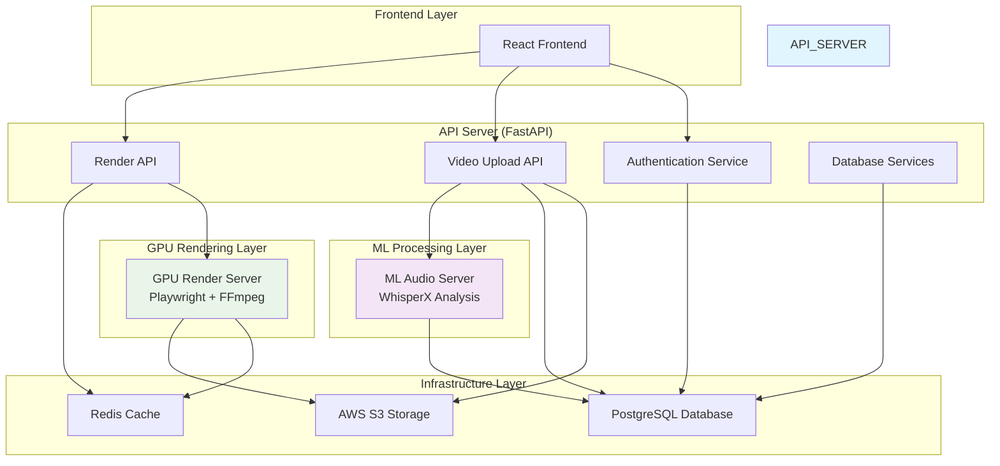

# ECG System Architecture Overview
# ECG (Expressive Caption Generation) 시스템 아키텍처 문서

## 🏗️ 전체 시스템 아키텍처

ECG 시스템은 **마이크로서비스 아키텍처**를 기반으로 하는 **2단계 비디오 처리 파이프라인**입니다.



## 🔄 2단계 처리 시스템 (Two-Phase Processing)

### Phase 1: 영상 업로드 및 음성 분석
```
Frontend → API Server → S3 Storage → ML Audio Server → Database
   ↓           ↓            ↓             ↓              ↓
Upload     Process &    Store Video   WhisperX        Store
Video      Validate     + Metadata    Analysis        Results
Request    (+Auth)      (Presigned)   (Async)         (JSON)
```

### Phase 2: 영상 내보내기 및 GPU 렌더링
```
Frontend → API Server → GPU Render Server → S3 Storage
   ↓           ↓              ↓                  ↓
Export     Validate      Playwright +         Download
Request    (+Quotas)     FFmpeg Render        Rendered
(Scenario) (+Rate Limit) (20-40x Speed)       Video
```

## 🏛️ 아키텍처 핵심 원칙

### 1. 단일 책임 원칙 (Single Responsibility Principle)
- **API Server**: 인증, 업로드 관리, 렌더링 요청 처리
- **ML Audio Server**: 음성 분석 및 전사 전용
- **GPU Render Server**: 고성능 비디오 렌더링 전용

### 2. HTTP 기반 서비스 간 통신
- Celery → HTTP REST API 통신으로 변경
- 각 서버는 독립적으로 확장 가능
- 명확한 API 인터페이스로 서비스 분리

### 3. 읽기 전용 캐시 패턴
- API Server: Redis 읽기 전용
- GPU Server: Redis 단일 진실 공급원 (Single Source of Truth)

## 📊 데이터 흐름 아키텍처

### Phase 1 데이터 흐름
1. **Frontend** → Presigned URL 요청
2. **API Server** → S3 Presigned URL 생성
3. **Frontend** → S3 직접 업로드
4. **API Server** → ML Server에 분석 요청
5. **ML Server** → WhisperX로 음성 분석
6. **ML Server** → Webhook으로 결과 콜백

### Phase 2 데이터 흐름
1. **Frontend** → 렌더링 시나리오 전송
2. **API Server** → 사용자 쿼터 확인
3. **API Server** → GPU Server에 렌더링 요청
4. **GPU Server** → Redis에 진행 상황 저장
5. **API Server** → Redis에서 진행 상황 조회
6. **GPU Server** → S3에 결과 업로드

## 🔧 핵심 기술 스택

### Backend Core
- **FastAPI**: 고성능 웹 프레임워크
- **SQLAlchemy 2.0**: 현대적 ORM
- **Pydantic**: 데이터 검증 및 시리얼라이제이션
- **aiohttp**: 비동기 HTTP 클라이언트

### 인증 & 보안
- **JWT**: Bearer 토큰 인증
- **OAuth 2.0**: Google 소셜 로그인
- **Authlib**: OAuth 통합 라이브러리
- **bcrypt**: 패스워드 해싱

### 데이터 저장소
- **PostgreSQL**: 주요 관계형 데이터베이스
- **Redis**: 실시간 상태 캐시
- **AWS S3**: 클라우드 파일 스토리지

### 영상 처리
- **WhisperX**: 음성 인식 및 화자 분리
- **Playwright**: 웹 기반 비디오 생성
- **FFmpeg**: 하드웨어 가속 비디오 인코딩

### 인프라스트럭처
- **Docker**: 컨테이너화
- **Docker Compose**: 개발 환경 오케스트레이션
- **GitHub Actions**: CI/CD 파이프라인

## 🛡️ 보안 및 안정성 패턴

### 인증 및 권한
- JWT 기반 무상태 인증
- Google OAuth 2.0 통합
- 사용자별 렌더링 쿼터 관리
- API Rate Limiting (20/분)

### 에러 처리
- 구조화된 에러 응답 시스템
- Circuit Breaker 패턴
- 타임아웃 관리
- 자동 재시도 로직

### 모니터링
- 구조화된 로깅
- 헬스체크 엔드포인트
- Phase 2 성능 메트릭
- 실시간 진행 상황 추적

## 🚀 성능 최적화 기법

### 비동기 처리
- FastAPI 비동기 엔드포인트
- Background Tasks
- 비블로킹 I/O

### 캐시 전략
- Redis 상태 캐시
- S3 Presigned URL 캐시
- 읽기 전용 캐시 패턴

### 스케일링 전략
- 서비스별 독립적 확장
- 스테이트리스 API 서버
- 외부 GPU 서버 클러스터

## 📈 모니터링 및 메트릭

### 시스템 메트릭
- API 응답 시간
- 데이터베이스 연결 풀
- Redis 캐시 히트율
- S3 업로드/다운로드 성능

### 비즈니스 메트릭
- 일일/월간 사용량 통계
- 렌더링 성공/실패율
- 평균 처리 시간
- 사용자별 쿼터 사용률

---

> 본 아키텍처는 **고가용성**, **확장성**, **유지보수성**을 중점으로 설계되었으며, 각 컴포넌트는 독립적으로 개발, 배포, 확장이 가능합니다.