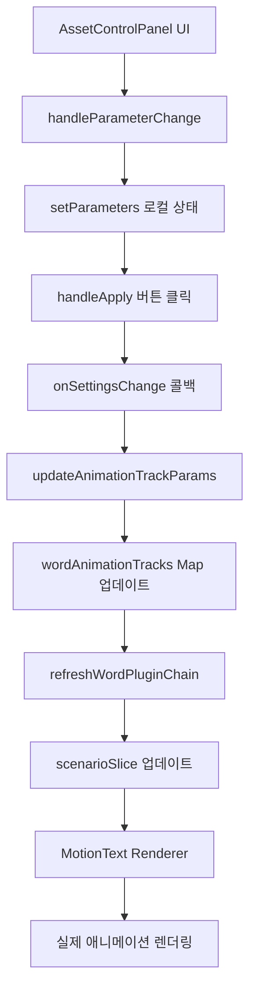

# Animation Asset Parameter Flow Documentation

이 문서는 ECG Frontend의 애니메이션 에셋 시스템에서 플러그인 파라미터가 UI에서 시나리오까지 어떻게 전달되는지 상세히 설명합니다.

## 📋 목차

1. [시스템 개요](#시스템-개요)
2. [UI 컴포넌트 연관관계](#ui-컴포넌트-연관관계)
3. [데이터 플로우](#데이터-플로우)
4. [파라미터 변경 프로세스](#파라미터-변경-프로세스)
5. [기술적 아키텍처](#기술적-아키텍처)
6. [실제 코드 예시](#실제-코드-예시)

## 🔍 시스템 개요

ECG의 애니메이션 시스템은 **단어별 애니메이션 트랙**을 기반으로 하며, 각 단어당 최대 3개의 애니메이션 효과를 적용할 수 있습니다. 시스템의 핵심 구성요소는 다음과 같습니다:

- **Animation Asset Sidebar**: 사용 가능한 플러그인 선택 및 적용
- **Sound Wave Visualization**: 오디오 타이밍과 애니메이션 동기화
- **Asset Control Panel**: 플러그인 파라미터 세부 조정 모달
- **MotionText Renderer**: 최종 애니메이션 렌더링

## 🔗 UI 컴포넌트 연관관계

### 1. 메인 에디터 구조

```
EditorPage
├── VideoSection (비디오 플레이어 + 자막 오버레이)
├── SubtitleEditList
│   └── ClipComponent (각 자막 클립)
│       ├── ClipWords (단어 레벨 편집)
│       │   └── ClipWord (개별 단어 + 애니메이션 트랙 표시)
│       └── ExpandedClipWaveform (음성 파형 시각화)
├── AnimationAssetSidebar
│   ├── AssetGrid (플러그인 선택)
│   ├── AssetControlPanel (파라미터 조정 모달)
│   └── UsedAssetsStrip (적용된 애니메이션 목록)
```

### 2. 컴포넌트 간 상호작용

#### 애니메이션 적용 플로우:

1. **AssetGrid**에서 플러그인 선택 → 단어에 애니메이션 트랙 추가
2. **ClipWord**에서 트랙 클릭 → **AssetControlPanel** 모달 열림
3. **AssetControlPanel**에서 파라미터 조정 → 실시간 업데이트
4. **ExpandedClipWaveform**에서 타이밍 조정 → 트랙 타이밍 업데이트

#### 음성 파형과 애니메이션 연동:

- `real.json`의 오디오 분석 데이터 사용
- 단어별 볼륨, 피치 정보를 파형에 시각화
- 애니메이션 트랙의 타이밍과 강도를 음성 데이터와 동기화

## 📊 데이터 플로우

### 1. 상태 관리 구조

```typescript
// WordSlice - 단어별 애니메이션 트랙 관리
interface AnimationTrack {
  assetId: string // 플러그인 고유 ID
  assetName: string // 표시용 이름
  pluginKey: string // 실제 플러그인 키 (예: "cwi-bouncing@2.0.0")
  params: Record<string, unknown> // 플러그인 파라미터
  timing: { start: number; end: number } // 애니메이션 타이밍
  intensity: { min: number; max: number } // 강도 범위
  color: 'blue' | 'green' | 'purple' // UI 색상
  timeOffset?: [number, number] // [preOffset, postOffset]
}

// 전역 상태
wordAnimationTracks: Map<string, AnimationTrack[]> // 단어ID → 트랙 배열
```

### 2. 파라미터 변경부터 시나리오 반영까지의 전체 플로우



### 3. 시나리오 생성 과정

#### initialScenario.ts에서의 플러그인 체인 생성:

```typescript
// 단어별 애니메이션 트랙을 시나리오 노드로 변환
const animationTracks = wordAnimationTracks?.get(word.id)
if (animationTracks && animationTracks.length > 0) {
  child.pluginChain = animationTracks
    .filter((track) => track.pluginKey)
    .map((track) => ({
      name: track.pluginKey, // 플러그인 이름
      params: track.params || {}, // 사용자 설정 파라미터
      timeOffset: track.timeOffset, // 타이밍 오프셋
    }))
}
```

## ⚙️ 파라미터 변경 프로세스

### 1. 플러그인 선택 및 적용

```typescript
// AssetGrid에서 플러그인 클릭
const handleAssetClick = (asset) => {
  // 현재 선택된 단어들에 애니메이션 트랙 추가
  if (isMultipleWordsSelected()) {
    toggleAnimationForWords(Array.from(multiSelectedWordIds), asset)
  } else if (focusedWordId) {
    addAnimationTrackAsync(
      focusedWordId,
      asset.id,
      asset.name,
      wordTiming,
      asset.pluginKey
    )
  }
}
```

### 2. 파라미터 UI 생성

```typescript
// AssetControlPanel에서 매니페스트 기반 UI 생성
const manifest = await loadPluginManifest(pluginKey)
const initialParams = getDefaultParameters(manifest)

// PluginParameterControls에서 동적 UI 렌더링
{manifest.schema && Object.entries(manifest.schema).map(([key, property]) => (
  <ParameterControl
    key={key}
    property={property}
    value={parameters[key]}
    onChange={(value) => handleParameterChange(key, value)}
  />
))}
```

### 3. 파라미터 업데이트 전파

```typescript
// 파라미터 변경 → 스토어 업데이트
const handleApply = () => {
  onSettingsChange?.(parameters as AssetSettings)
}

// WordSlice에서 트랙 파라미터 업데이트
updateAnimationTrackParams: (wordId, assetId, partialParams) => {
  // 1. wordAnimationTracks Map 업데이트
  const updated = existing.map((t) =>
    t.assetId === assetId
      ? { ...t, params: { ...(t.params || {}), ...partialParams } }
      : t
  )

  // 2. 시나리오 새로고침
  refreshWordPluginChain(wordId)

  // 3. 클립 데이터 동기화
  updateWordAnimationTracks(clipId, wordId, updated)
}
```

### 4. 시나리오 실시간 업데이트

```typescript
// ScenarioSlice에서 플러그인 체인 갱신
refreshWordPluginChain: (wordId) => {
  const tracks = wordAnimationTracks?.get(wordId) || []
  const pluginChain = tracks.map((t) => ({
    name: t.pluginKey.split('@')[0], // 버전 제거
    params: t.params || {}, // 업데이트된 파라미터
    baseTime, // 단어 기본 타이밍
    timeOffset, // 계산된 시간 오프셋
  }))

  // 시나리오 노드에 플러그인 체인 적용
  node.pluginChain = pluginChain

  // 버전 증가로 렌더러 업데이트 트리거
  set({ scenarioVersion: scenarioVersion + 1 })
}
```

## 🏗️ 기술적 아키텍처

### 1. 스토어 구조

```typescript
// EditorStore = WordSlice + ScenarioSlice + ClipSlice + UISlice + ...
const useEditorStore = create<EditorStore>()(
  subscribeWithSelector((...args) => ({
    ...createWordSlice(...args), // 단어/애니메이션 관리
    ...createScenarioSlice(...args), // 시나리오 생성/업데이트
    ...createClipSlice(...args), // 클립 데이터
    ...createUISlice(...args), // UI 상태
    // ... 기타 슬라이스들
  }))
)
```

### 2. 플러그인 매니페스트 시스템

```typescript
// 플러그인 서버에서 매니페스트 로드
const loadPluginManifest = async (pluginKey: string) => {
  const serverBase = process.env.NEXT_PUBLIC_MOTIONTEXT_PLUGIN_ORIGIN || 'http://localhost:3300'
  const response = await fetch(`${serverBase}/plugins/${pluginKey}/manifest.json`)
  return await response.json()
}

// 매니페스트 스키마 예시
{
  "name": "CWI Bouncing",
  "version": "2.0.0",
  "schema": {
    "intensity": {
      "type": "number",
      "default": 0.5,
      "min": 0,
      "max": 1,
      "i18n": {
        "label": { "ko": "강도" },
        "description": { "ko": "바운싱 효과의 강도를 조절합니다" }
      },
      "ui": { "control": "slider", "unit": "" }
    },
    "speed": {
      "type": "number",
      "default": 1,
      "min": 0.1,
      "max": 3,
      "i18n": { "label": { "ko": "속도" } }
    }
  }
}
```

### 3. MotionText 렌더러 통합

```typescript
// 시나리오가 업데이트되면 자동으로 렌더러에 반영
useEffect(() => {
  if (currentScenario && scenarioVersion > 0) {
    // MotionText 렌더러에 새 시나리오 전달
    motionTextRenderer.loadScenario(currentScenario)
  }
}, [currentScenario, scenarioVersion])
```

## 💻 실제 코드 예시

### 1. 플러그인 파라미터 UI 생성

```typescript
// PluginParameterControls.tsx
const NumberControl: React.FC<ControlProps> = ({ property, value, onChange }) => {
  const numValue = typeof value === 'number' ? value : Number(value) || property.default
  const min = property.min ?? 0
  const max = property.max ?? 100
  const step = property.step ?? 1

  return (
    <div className="space-y-2">
      <input
        type="range"
        min={min}
        max={max}
        step={step}
        value={numValue}
        onChange={(e) => onChange(Number(e.target.value))} // 실시간 파라미터 업데이트
        className="flex-1 h-2 bg-gray-300 rounded-lg"
      />
      <input
        type="number"
        value={numValue}
        onChange={(e) => onChange(Number(e.target.value))}
        className="w-16 px-2 py-1 text-sm bg-gray-700 border rounded"
      />
    </div>
  )
}
```

### 2. 음성 파형과 애니메이션 동기화

```typescript
// ExpandedClipWaveform.tsx
const loadRangeAudioData = async (
  startTime: number,
  endTime: number,
  words: Word[]
) => {
  const response = await fetch('/real.json')
  const audioData = await response.json()

  // 시간 범위에 해당하는 음성 데이터 추출
  const volumeData = []
  for (let i = 0; i < totalSamples; i++) {
    const currentTime = startTime + (i / totalSamples) * duration

    // 현재 시간에 해당하는 단어 찾기
    const containingWord = words.find(
      (word) => currentTime >= word.start && currentTime <= word.end
    )

    if (containingWord) {
      // real.json에서 해당 단어의 볼륨/피치 데이터 추출
      const wordData = audioData.segments.find((segment) =>
        segment.words?.find((w) => w.word === containingWord.text)
      )
      currentVolume = wordData?.volume_db || -20
    }

    volumeData.push(currentVolume)
  }

  return volumeData
}
```

### 3. 애니메이션 트랙 시각화

```typescript
// ClipWord.tsx에서 애니메이션 트랙 표시
const animationTracks = wordAnimationTracks.get(word.id) || []

return (
  <div className="word-container">
    <span className="word-text">{word.text}</span>

    {/* 애니메이션 트랙 바 표시 */}
    <div className="animation-tracks">
      {animationTracks.map((track, index) => (
        <div
          key={track.assetId}
          className={`track-bar track-${track.color}`}
          onClick={() => openAssetControlPanel(track.assetName, track.assetId)}
          style={{
            width: `${((track.timing.end - track.timing.start) / (word.end - word.start)) * 100}%`,
            left: `${((track.timing.start - word.start) / (word.end - word.start)) * 100}%`
          }}
        >
          {track.assetName}
        </div>
      ))}
    </div>
  </div>
)
```

## 🔄 상태 동기화 메커니즘

### 1. 다중 데이터 소스 동기화

시스템은 다음 3곳에서 애니메이션 데이터를 관리합니다:

1. **WordSlice.wordAnimationTracks**: 메인 애니메이션 트랙 데이터
2. **ClipSlice.clips[].words[].animationTracks**: UI 표시용 미러 데이터
3. **ScenarioSlice.currentScenario**: 렌더링용 시나리오 데이터

### 2. 동기화 보장 메커니즘

```typescript
// 파라미터 업데이트 시 모든 데이터 소스 동기화
updateAnimationTrackParams: (wordId, assetId, params) => {
  // 1. 메인 스토어 업데이트
  newTracks.set(wordId, updated)

  // 2. 시나리오 갱신
  refreshWordPluginChain(wordId)

  // 3. 클립 데이터 미러링
  if (updateWordAnimationTracks && clips) {
    for (const clip of clips) {
      const hasWord = clip.words?.some((w) => w.id === wordId)
      if (hasWord) {
        updateWordAnimationTracks(clipId, wordId, updated)
        break
      }
    }
  }
}
```

## 🎯 최적화 및 성능

### 1. 지연 로딩

- 플러그인 매니페스트는 필요시에만 로드
- 시나리오는 렌더러 초기화 시점에 빌드

### 2. 메모이제이션

- 파라미터 변경 시에만 플러그인 체인 재생성
- 시나리오 버전으로 불필요한 업데이트 방지

### 3. 에러 처리

- 플러그인 로드 실패 시 fallback 처리
- 매니페스트 없는 플러그인에 대한 graceful degradation

## 📝 요약

ECG의 애니메이션 파라미터 시스템은 다음과 같은 특징을 가집니다:

1. **사용자 친화적 UI**: 매니페스트 기반 동적 컨트롤 생성
2. **실시간 반영**: 파라미터 변경이 즉시 렌더링에 반영
3. **음성 연동**: 오디오 분석 데이터와 애니메이션 동기화
4. **확장 가능**: 새로운 플러그인 추가가 용이한 구조
5. **데이터 일관성**: 다중 스토어 간 자동 동기화

이 시스템을 통해 사용자는 직관적인 인터페이스로 복잡한 애니메이션 효과를 세밀하게 조정할 수 있으며, 개발자는 새로운 애니메이션 플러그인을 쉽게 추가할 수 있습니다.
