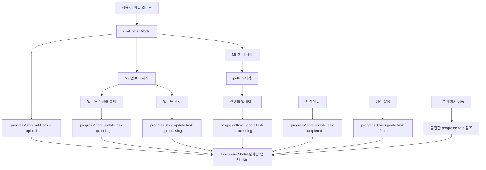

# 문서함 프로그레스바 실제 진행도 연동 구현 계획

## 🎯 목표

1. **업로드 & 내보내기 탭 연동**: 문서함 모달의 하드코딩된 업로드/내보내기 프로그레스바를 실제 ProcessingModal 진행도와 연동
2. **전역 상태 공유**: 에디터, 메인페이지, 에셋스토어 모든 페이지에서 동일한 진행 상태 실시간 확인
3. **실시간 동기화**: useUploadModal의 polling 데이터를 문서함과 완전 동기화

## 📋 현재 상황 분석

### 문제점

- DocumentModal의 업로드/내보내기 탭에서 하드코딩된 mock 데이터 사용
- 실제 ProcessingModal의 진행도와 문서함 표시가 불일치
- 페이지별로 독립적인 상태로 인한 일관성 부족

### 현재 구조

```
useUploadModal → ProcessingModal (실제 진행도)
     ❌
DocumentModal ← Mock 데이터 (하드코딩)
```

### 목표 구조

```
useUploadModal → ProgressStore ← DocumentModal
       ↓               ↓              ↓
ProcessingModal    전역 상태       모든 페이지
```

## 🔧 구현 계획

### 1단계: 글로벌 진행 상태 스토어 생성

#### 파일: `src/lib/store/progressStore.ts`

```typescript
import { create } from 'zustand'
import { persist } from 'zustand/middleware'

export interface ProgressTask {
  id: string
  type: 'upload' | 'processing'
  filename: string
  progress: number
  status: 'uploading' | 'processing' | 'completed' | 'failed'
  currentStage?: string
  estimatedTimeRemaining?: number
  completedAt?: string
  jobId?: string
  step?: 'uploading' | 'processing' // useUploadModal의 step과 매핑
}

interface ProgressState {
  tasks: ProgressTask[]
  activeTasks: ProgressTask[]
  completedTasks: ProgressTask[]
}

interface ProgressActions {
  addTask: (task: Omit<ProgressTask, 'id'>) => string
  updateTask: (id: string, updates: Partial<ProgressTask>) => void
  removeTask: (id: string) => void
  clearCompletedTasks: () => void
  getActiveUploadTasks: () => ProgressTask[]
  getActiveProcessingTasks: () => ProgressTask[]
  findTaskByJobId: (jobId: string) => ProgressTask | undefined
}

type ProgressStore = ProgressState & ProgressActions

export const useProgressStore = create<ProgressStore>()(
  persist(
    (set, get) => ({
      tasks: [],

      get activeTasks() {
        return get().tasks.filter(
          (task) => task.status === 'uploading' || task.status === 'processing'
        )
      },

      get completedTasks() {
        return get().tasks.filter(
          (task) => task.status === 'completed' || task.status === 'failed'
        )
      },

      addTask: (taskData) => {
        const id = `task-${Date.now()}-${Math.random().toString(36).substr(2, 9)}`
        const task = { ...taskData, id }
        set((state) => ({
          tasks: [...state.tasks, task],
        }))
        return id
      },

      updateTask: (id, updates) => {
        set((state) => ({
          tasks: state.tasks.map((task) =>
            task.id === id ? { ...task, ...updates } : task
          ),
        }))
      },

      removeTask: (id) => {
        set((state) => ({
          tasks: state.tasks.filter((task) => task.id !== id),
        }))
      },

      clearCompletedTasks: () => {
        set((state) => ({
          tasks: state.tasks.filter(
            (task) => task.status !== 'completed' && task.status !== 'failed'
          ),
        }))
      },

      getActiveUploadTasks: () => {
        return get().tasks.filter((task) => task.status === 'uploading')
      },

      getActiveProcessingTasks: () => {
        return get().tasks.filter((task) => task.status === 'processing')
      },

      findTaskByJobId: (jobId) => {
        return get().tasks.find((task) => task.jobId === jobId)
      },
    }),
    {
      name: 'ecg-progress-storage',
      partialize: (state) => ({
        tasks: state.tasks.filter((task) => {
          // 완료된 작업은 24시간만 보존
          if (task.status === 'uploading' || task.status === 'processing') {
            return true
          }
          if (task.completedAt) {
            const completedTime = new Date(task.completedAt).getTime()
            const now = new Date().getTime()
            return now - completedTime < 24 * 60 * 60 * 1000 // 24시간
          }
          return false
        }),
      }),
    }
  )
)
```

### 2단계: useUploadModal 연동

#### 파일: `src/hooks/useUploadModal.ts` 수정

```typescript
// 추가 import
import { useProgressStore } from '@/lib/store/progressStore'

export const useUploadModal = () => {
  // 기존 코드...
  const { addTask, updateTask, removeTask, findTaskByJobId } =
    useProgressStore()
  const [currentTaskId, setCurrentTaskId] = useState<string>()

  // 업로드 시작 시 태스크 추가
  const handleStartTranscription = useCallback(
    async (data: UploadFormData) => {
      try {
        log('useUploadModal', '🚀 Starting upload and transcription process')

        // 진행 상태 태스크 생성
        const taskId = addTask({
          type: 'upload',
          filename: data.file.name,
          progress: 0,
          status: 'uploading',
          step: 'uploading',
        })
        setCurrentTaskId(taskId)

        // 기존 초기화 로직...
        clearMedia()
        setClips([])
        // ... 기존 코드

        // 1. Presigned URL 요청
        updateState({ step: 'uploading', uploadProgress: 0 })

        // ... presigned URL 로직

        // 2. S3 업로드 (진행률 추적)
        const uploadResponse = await uploadService.uploadToS3(
          data.file,
          presigned_url,
          (progress) => {
            updateState({ uploadProgress: progress })
            // ProgressStore 업데이트
            updateTask(taskId, {
              progress,
              status: 'uploading',
              step: 'uploading',
            })
          }
        )

        // 3. 처리 단계로 전환
        updateState({ step: 'processing', processingProgress: 0 })
        updateTask(taskId, {
          type: 'processing',
          status: 'processing',
          progress: 0,
          step: 'processing',
        })

        // 4. ML 처리 요청
        const mlResponse = await uploadService.requestMLProcessing(
          file_key,
          data.language
        )

        const { job_id, estimated_time } = mlResponse.data
        setCurrentJobId(job_id)

        // jobId를 태스크에 저장
        updateTask(taskId, {
          jobId: job_id,
          estimatedTimeRemaining: estimated_time || 180,
        })

        // 5. 상태 폴링 시작
        const stopPolling = uploadService.startPolling(
          job_id,
          (status: ProcessingStatus) => {
            log(
              'useUploadModal',
              `📊 Status update: ${status.status} (${status.progress}%)`
            )

            updateState({
              processingProgress: status.progress,
              currentStage: status.current_stage,
              estimatedTimeRemaining: status.estimated_time_remaining,
            })

            // ProgressStore 업데이트
            updateTask(taskId, {
              progress: status.progress,
              currentStage: status.current_stage,
              estimatedTimeRemaining: status.estimated_time_remaining,
              status: 'processing',
            })
          },
          (result: ProcessingResult) => {
            log('useUploadModal', '🎉 Processing completed successfully')

            // 완료 처리
            updateTask(taskId, {
              status: 'completed',
              progress: 100,
              completedAt: new Date().toLocaleString('ko-KR'),
            })

            handleProcessingComplete(result)
          },
          (error) => {
            const errorMessage =
              error?.message || error?.error || 'Unknown error'
            log('useUploadModal', `❌ Processing failed: ${errorMessage}`)

            // 에러 처리
            updateTask(taskId, {
              status: 'failed',
              completedAt: new Date().toLocaleString('ko-KR'),
            })

            // 기존 에러 핸들링...
          }
        )

        stopPollingRef.current = stopPolling
      } catch (error) {
        log('useUploadModal', `💥 Upload process failed: ${error}`)

        if (currentTaskId) {
          updateTask(currentTaskId, {
            status: 'failed',
            completedAt: new Date().toLocaleString('ko-KR'),
          })
        }

        // 기존 에러 핸들링...
      }
    },
    [addTask, updateTask, removeTask, currentTaskId /* 기존 dependencies */]
  )

  // 취소 시 태스크 제거
  const cancelProcessing = useCallback(async () => {
    if (currentJobId) {
      log('useUploadModal', `🛑 Cancelling job: ${currentJobId}`)
      await uploadService.cancelProcessing(currentJobId)
    }

    if (currentTaskId) {
      removeTask(currentTaskId)
    }

    if (stopPollingRef.current) {
      stopPollingRef.current()
      stopPollingRef.current = null
    }

    closeModal()
  }, [currentJobId, currentTaskId, removeTask, closeModal])

  // 기존 return 코드...
}
```

### 3단계: DocumentModal 개선

#### 파일: `src/components/ui/DocumentModal.tsx` 수정

```typescript
import { useProgressStore } from '@/lib/store/progressStore'

export interface DocumentModalProps {
  isOpen: boolean
  onClose: () => void
  buttonRef: React.RefObject<HTMLButtonElement | null>
  onDeployClick?: (task: any) => void
}

const DocumentModal: React.FC<DocumentModalProps> = ({
  isOpen,
  onClose,
  buttonRef,
  onDeployClick,
}) => {
  const [activeTab, setActiveTab] = useState<'export' | 'upload'>('export')
  const modalRef = useRef<HTMLDivElement>(null)
  const [position, setPosition] = useState({ top: 0, left: 0 })
  const [isMounted, setIsMounted] = useState(false)

  // ProgressStore에서 실제 데이터 가져오기
  const { activeTasks, completedTasks, clearCompletedTasks } = useProgressStore()

  // 업로드와 처리 작업 분리
  const activeUploadTasks = activeTasks.filter(task =>
    task.status === 'uploading' || (task.step === 'uploading')
  )
  const activeProcessingTasks = activeTasks.filter(task =>
    task.status === 'processing' || (task.step === 'processing')
  )

  // Export 탭용 데이터 (processing 작업들)
  const exportTasks = [
    ...activeProcessingTasks.map(task => ({
      id: parseInt(task.id.split('-')[1]) || Math.random(),
      filename: task.filename,
      progress: task.progress,
      status: task.status as 'processing' | 'completed',
      currentStage: task.currentStage,
      estimatedTimeRemaining: task.estimatedTimeRemaining
    })),
    ...completedTasks
      .filter(task => task.type === 'processing')
      .map(task => ({
        id: parseInt(task.id.split('-')[1]) || Math.random(),
        filename: task.filename,
        progress: task.progress,
        status: task.status as 'processing' | 'completed',
        completedAt: task.completedAt
      }))
  ]

  // Upload 탭용 데이터 (upload 작업들)
  const uploadTasks = [
    ...activeUploadTasks.map(task => ({
      id: parseInt(task.id.split('-')[1]) || Math.random(),
      filename: task.filename,
      progress: task.progress,
      status: task.status as 'uploading' | 'completed' | 'failed',
      currentStage: task.currentStage
    })),
    ...completedTasks
      .filter(task => task.type === 'upload')
      .map(task => ({
        id: parseInt(task.id.split('-')[1]) || Math.random(),
        filename: task.filename,
        progress: task.progress,
        status: task.status as 'uploading' | 'completed' | 'failed',
        completedAt: task.completedAt
      }))
  ]

  // 기존 position, click outside 로직...

  if (!isOpen || !isMounted) return null

  return createPortal(
    <div
      ref={modalRef}
      className="fixed w-96 bg-white rounded-lg shadow-lg border border-gray-200 z-[9997]"
      style={{
        top: position.top,
        left: position.left,
      }}
    >
      {/* Tab Bar */}
      <div className="flex border-b border-gray-200">
        <button
          onClick={() => setActiveTab('export')}
          className={`flex-1 px-4 py-3 text-sm font-medium transition-colors ${
            activeTab === 'export'
              ? 'text-black border-b-2 border-black bg-gray-50'
              : 'text-gray-600 hover:text-black'
          }`}
        >
          내보내기
        </button>
        <button
          onClick={() => setActiveTab('upload')}
          className={`flex-1 px-4 py-3 text-sm font-medium transition-colors ${
            activeTab === 'upload'
              ? 'text-black border-b-2 border-black bg-gray-50'
              : 'text-gray-600 hover:text-black'
          }`}
        >
          업로드
        </button>
      </div>

      {/* Tab Content */}
      <div className="p-4 max-h-80 overflow-y-auto">
        {activeTab === 'export' && (
          <div className="space-y-4">
            {/* 현재 진행중인 내보내기 */}
            <div>
              <h3 className="text-sm font-semibold text-gray-800 mb-3">
                현재 진행중인 내보내기
              </h3>
              {activeProcessingTasks.length === 0 ? (
                <div className="text-center py-6">
                  <div className="w-10 h-10 mx-auto mb-2 bg-gray-100 rounded-full flex items-center justify-center">
                    <svg className="w-5 h-5 text-gray-400" fill="none" stroke="currentColor" viewBox="0 0 24 24">
                      <path strokeLinecap="round" strokeLinejoin="round" strokeWidth={2} d="M9 12h6m-6 4h6m2 5H7a2 2 0 01-2-2V5a2 2 0 012-2h5.586a1 1 0 01.707.293l5.414 5.414a1 1 0 01.293.707V19a2 2 0 01-2 2z" />
                    </svg>
                  </div>
                  <p className="text-xs text-gray-500">진행 중인 내보내기가 없습니다</p>
                </div>
              ) : (
                <div className="space-y-2">
                  {activeProcessingTasks.map((task) => (
                    <div key={task.id} className="bg-gray-50 rounded-lg p-3">
                      <div className="flex items-center justify-between mb-2">
                        <span className="text-sm font-medium text-gray-800 truncate">
                          {task.filename}
                        </span>
                        <span className="text-xs text-black font-medium">
                          {Math.round(task.progress)}%
                        </span>
                      </div>
                      <div className="w-full bg-gray-200 rounded-full h-2">
                        <div
                          className="bg-black h-2 rounded-full transition-all duration-300"
                          style={{ width: `${task.progress}%` }}
                        />
                      </div>
                      <div className="flex items-center mt-2">
                        <div className="w-2 h-2 bg-gray-600 rounded-full animate-pulse mr-2" />
                        <span className="text-xs text-gray-600">
                          {task.currentStage || '처리 중...'}
                        </span>
                        {task.estimatedTimeRemaining && (
                          <span className="text-xs text-gray-500 ml-auto">
                            약 {Math.ceil(task.estimatedTimeRemaining / 60)}분 남음
                          </span>
                        )}
                      </div>
                    </div>
                  ))}
                </div>
              )}
            </div>

            {/* 완료된 내보내기 */}
            <div className="border-t border-gray-200 pt-4">
              <div className="flex justify-between items-center mb-3">
                <h3 className="text-sm font-semibold text-gray-800">종료된 내보내기</h3>
                {completedTasks.filter(task => task.type === 'processing').length > 0 && (
                  <button
                    onClick={clearCompletedTasks}
                    className="text-xs text-gray-500 hover:text-gray-700"
                  >
                    모두 지우기
                  </button>
                )}
              </div>
              {/* 완료된 작업 렌더링 로직... */}
            </div>
          </div>
        )}

        {activeTab === 'upload' && (
          <div className="space-y-4">
            {/* 현재 진행중인 업로드 */}
            <div>
              <h3 className="text-sm font-semibold text-gray-800 mb-3">
                현재 진행중인 업로드
              </h3>
              {activeUploadTasks.length === 0 ? (
                <div className="text-center py-6">
                  <div className="w-10 h-10 mx-auto mb-2 bg-gray-100 rounded-full flex items-center justify-center">
                    <svg className="w-5 h-5 text-gray-400" fill="none" stroke="currentColor" viewBox="0 0 24 24">
                      <path strokeLinecap="round" strokeLinejoin="round" strokeWidth={2} d="M7 16a4 4 0 01-.88-7.903A5 5 0 1115.9 6L16 6a5 5 0 011 9.9M15 13l-3-3m0 0l-3 3m3-3v12" />
                    </svg>
                  </div>
                  <p className="text-xs text-gray-500">진행 중인 업로드가 없습니다</p>
                </div>
              ) : (
                <div className="space-y-2">
                  {activeUploadTasks.map((task) => (
                    <div key={task.id} className="bg-blue-50 rounded-lg p-3">
                      <div className="flex items-center justify-between mb-2">
                        <span className="text-sm font-medium text-gray-800 truncate">
                          {task.filename}
                        </span>
                        <span className="text-xs text-black font-medium">
                          {Math.round(task.progress)}%
                        </span>
                      </div>
                      <div className="w-full bg-gray-200 rounded-full h-2">
                        <div
                          className="bg-black h-2 rounded-full transition-all duration-300"
                          style={{ width: `${task.progress}%` }}
                        />
                      </div>
                      <div className="flex items-center mt-2">
                        <div className="w-2 h-2 bg-gray-600 rounded-full animate-pulse mr-2" />
                        <span className="text-xs text-gray-600">
                          {task.status === 'uploading' ? '업로드 중...' : task.currentStage || '처리 중...'}
                        </span>
                      </div>
                    </div>
                  ))}
                </div>
              )}
            </div>

            {/* 완료된 업로드 */}
            <div className="border-t border-gray-200 pt-4">
              <h3 className="text-sm font-semibold text-gray-800 mb-3">종료된 업로드</h3>
              {/* 완료된 업로드 렌더링 로직... */}
            </div>
          </div>
        )}
      </div>
    </div>,
    document.body
  )
}

export default DocumentModal
```

### 4단계: 공통 훅 생성

#### 파일: `src/hooks/useProgressTasks.ts`

```typescript
import { useProgressStore } from '@/lib/store/progressStore'
import { useMemo } from 'react'

export const useProgressTasks = () => {
  const { activeTasks, completedTasks } = useProgressStore()

  const exportTasks = useMemo(() => {
    const processingTasks = activeTasks.filter(
      (task) => task.status === 'processing' || task.step === 'processing'
    )
    const completedProcessingTasks = completedTasks.filter(
      (task) => task.type === 'processing'
    )

    return [...processingTasks, ...completedProcessingTasks].map((task) => ({
      id: parseInt(task.id.split('-')[1]) || Math.random(),
      filename: task.filename,
      progress: task.progress,
      status: task.status as 'processing' | 'completed',
      completedAt: task.completedAt,
      currentStage: task.currentStage,
      estimatedTimeRemaining: task.estimatedTimeRemaining,
    }))
  }, [activeTasks, completedTasks])

  const uploadTasks = useMemo(() => {
    const uploadingTasks = activeTasks.filter(
      (task) => task.status === 'uploading' || task.step === 'uploading'
    )
    const completedUploadTasks = completedTasks.filter(
      (task) => task.type === 'upload'
    )

    return [...uploadingTasks, ...completedUploadTasks].map((task) => ({
      id: parseInt(task.id.split('-')[1]) || Math.random(),
      filename: task.filename,
      progress: task.progress,
      status: task.status as 'uploading' | 'completed' | 'failed',
      completedAt: task.completedAt,
      currentStage: task.currentStage,
    }))
  }, [activeTasks, completedTasks])

  return { exportTasks, uploadTasks }
}
```

### 5단계: 각 페이지 헤더 컴포넌트 수정

#### 파일: `src/app/(route)/editor/components/EditorHeaderTabs.tsx`

```typescript
import { useProgressTasks } from '@/hooks/useProgressTasks'

export default function EditorHeaderTabs(/* props */) {
  // Mock 데이터 제거하고 실제 데이터 사용
  const { exportTasks, uploadTasks } = useProgressTasks()

  // 기존 코드에서 Mock 데이터 부분 제거
  // const exportTasks = [...] // 삭제
  // const uploadTasks = [...] // 삭제

  return (
    <div className={getTabBarClasses()}>
      {/* 기존 UI 코드... */}

      <DocumentModal
        isOpen={isDocumentModalOpen}
        onClose={() => setIsDocumentModalOpen(false)}
        buttonRef={documentButtonRef}
        onDeployClick={handleDeployClick}
      />

      {/* 기존 UI 코드... */}
    </div>
  )
}
```

#### 파일: `src/components/NewLandingPage/Header.tsx`

```typescript
import { useProgressTasks } from '@/hooks/useProgressTasks'

const Header: React.FC<HeaderProps> = ({...props}) => {
  const { exportTasks, uploadTasks } = useProgressTasks()

  // TODO 주석 및 Mock 데이터 제거
  // const exportTasks = [...] // 삭제
  // const uploadTasks = [...] // 삭제

  return (
    <header className="sticky top-0 z-50 bg-white/95 backdrop-blur border-b border-gray-200 shadow-sm">
      {/* 기존 UI 코드... */}

      <DocumentModal
        isOpen={isDocumentModalOpen}
        onClose={() => setIsDocumentModalOpen(false)}
        buttonRef={buttonRef}
        onDeployClick={(task) => {
          openDeployModal({
            id: task.id,
            filename: task.filename,
          })
        }}
      />

      {/* 기존 UI 코드... */}
    </header>
  )
}
```

## 🔄 데이터 플로우



## 📁 파일 구조

```
src/
├── lib/store/
│   └── progressStore.ts          # 🆕 글로벌 진행 상태 스토어
├── hooks/
│   ├── useUploadModal.ts         # ✏️ progressStore 연동
│   └── useProgressTasks.ts       # 🆕 공통 진행 상태 훅
├── components/
│   ├── ui/DocumentModal.tsx      # ✏️ 실제 데이터 사용하도록 수정
│   └── NewLandingPage/Header.tsx # ✏️ progressStore 사용
└── app/(route)/editor/components/
    └── EditorHeaderTabs.tsx      # ✏️ progressStore 사용
```

## 🧪 테스트 시나리오

### 1. 기본 플로우 테스트

1. **에디터 페이지**에서 "새로 만들기" → "파일 선택" → "시작하기"
2. **ProcessingModal** 확인 (진행률 표시)
3. **다른 페이지로 이동** (메인페이지, 에셋스토어)
4. **문서함 아이콘 클릭**하여 동일한 진행률 확인
5. **업로드 탭과 내보내기 탭** 모두에서 올바른 진행률 표시 확인

### 2. 상태 지속성 테스트

1. 업로드 중 **페이지 새로고침**
2. 진행 중인 작업이 복구되는지 확인
3. **24시간 후** 완료된 작업 자동 정리 확인

### 3. 다중 작업 테스트

1. **여러 파일 동시 업로드** (가능한 경우)
2. 각각의 진행률이 독립적으로 표시되는지 확인
3. **완료 순서와 관계없이** 올바른 상태 표시 확인

### 4. 에러 상황 테스트

1. **업로드 중 네트워크 에러**
2. **처리 중 서버 에러**
3. **사용자 취소**
4. 각 상황에서 올바른 상태 표시 및 정리 확인

## ⚠️ 주의사항

1. **메모리 누수 방지**: 폴링 함수 정리 확실히 하기
2. **상태 동기화**: 여러 탭에서 동시 업로드 시 상태 충돌 방지
3. **성능 최적화**: useMemo, useCallback 적절히 사용
4. **에러 복구**: 네트워크 에러 시 재시도 로직
5. **데이터 정리**: 오래된 완료 작업 자동 정리
6. **타입 안전성**: ProgressTask 인터페이스와 기존 타입 호환성 확인

## 🚀 배포 후 확인사항

- [ ] 모든 페이지에서 문서함 진행률 동일하게 표시
- [ ] 실제 업로드/처리 진행률과 문서함 진행률 일치
- [ ] 업로드 탭과 내보내기 탭 모두 정확한 데이터 표시
- [ ] 페이지 새로고침 시 진행 상태 유지
- [ ] 완료된 작업 24시간 후 자동 정리
- [ ] 에러 상황에서 적절한 상태 표시
- [ ] 취소 기능 정상 동작
- [ ] 업로드에서 처리로 전환 시 올바른 탭 이동

## 📈 성능 고려사항

1. **Zustand persist**: 큰 데이터 저장 시 성능 영향 고려
2. **실시간 업데이트**: 너무 빈번한 업데이트 시 throttling 적용
3. **메모리 사용량**: 완료된 작업 데이터 적절한 시점에 정리
4. **네트워크 최적화**: 불필요한 API 호출 방지
