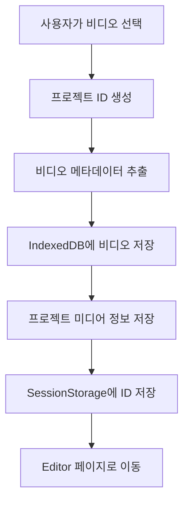
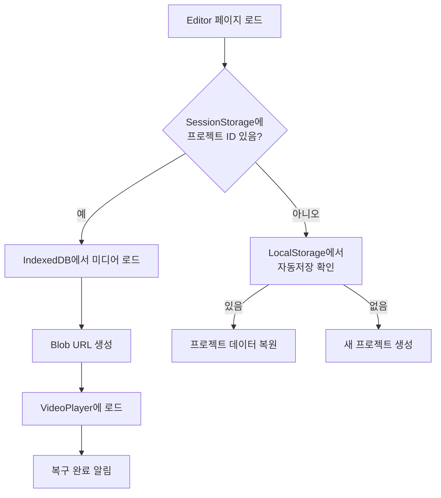

# 비디오 업로드 및 세션 복구 시스템 구현 문서

## 📋 개요

이 문서는 ECG 프로젝트에서 Vrew 스타일의 비디오 업로드 및 세션 복구 시스템을 구현한 내용을 설명합니다.

## 🎯 구현 목표

1. **사용자가 업로드한 비디오를 브라우저에 저장**
2. **브라우저를 닫았다가 다시 열어도 작업 복구**
3. **자동 저장 및 상태 표시**
4. **Vrew와 유사한 콘솔 로깅 시스템**

## 🏗️ 시스템 아키텍처

### 1. IndexedDB 기반 미디어 저장 시스템

```typescript
// src/utils/storage/mediaStorage.ts
```

#### 주요 기능:

- **비디오 파일을 Blob으로 IndexedDB에 저장**
- **프로젝트별 미디어 관리**
- **Blob URL 생성 및 캐싱**
- **30일 이상 미접근 파일 자동 정리**

#### 데이터베이스 구조:

```
ECGMediaStorage (DB)
├── media (Object Store)
│   ├── id: string (Primary Key)
│   ├── projectId: string
│   ├── fileName: string
│   ├── fileType: string
│   ├── fileSize: number
│   ├── blob: Blob
│   └── metadata: {...}
└── projectMedia (Object Store)
    ├── projectId: string (Primary Key)
    ├── mediaId: string
    └── metadata: {...}
```

### 2. AutosaveManager (자동 저장 관리자)

```typescript
// src/utils/managers/AutosaveManager.ts
```

#### 주요 기능:

- **3초마다 자동 저장**
- **저장 상태 추적 (idle, saving, saved, error)**
- **프로젝트 타입 관리 (browser, device, cloud)**
- **저장 큐 관리 및 재시도 로직**

#### 사용 예시:

```typescript
const autosaveManager = AutosaveManager.getInstance()
autosaveManager.setProject(projectId, 'browser')
autosaveManager.save(projectData)
```

### 3. ProjectInfoManager (프로젝트 정보 관리자)

```typescript
// src/utils/managers/ProjectInfoManager.ts
```

#### 주요 기능:

- **프로젝트 메타데이터 관리**
- **미디어 정보 추적**
- **Vrew 스타일 로깅**

#### 로그 형식:

```
[2025-09-08T17:10:09+09:00] ProjectInfoManager.ts ProjectInfoMgr.notifyFileOpen(type: browser, newProject: true)
[2025-09-08T17:10:09+09:00] vrewfile.ts vrewfile db1cc0a1-697c-4703 loaded, elapsed: 1.502s, size: 4.66 MB
```

## 📂 파일 구조

```
src/
├── utils/
│   ├── storage/
│   │   ├── mediaStorage.ts      # IndexedDB 미디어 저장
│   │   └── projectStorage.ts    # 프로젝트 데이터 저장
│   ├── managers/
│   │   ├── AutosaveManager.ts   # 자동 저장 관리
│   │   └── ProjectInfoManager.ts # 프로젝트 정보 관리
│   └── logger.ts                 # Vrew 스타일 로거
├── app/(route)/editor/
│   ├── store/
│   │   └── slices/
│   │       └── mediaSlice.ts    # 미디어 상태 관리
│   ├── components/
│   │   ├── VideoPlayer/         # 비디오 플레이어
│   │   └── EditorHeaderTabs.tsx # 저장 상태 UI
│   └── page.tsx                  # 에디터 페이지 (세션 복구)
└── hooks/
    └── useUploadModal.ts         # 업로드 처리
```

## 🔄 업로드 및 복구 플로우

### 업로드 플로우



### 세션 복구 플로우



## 💾 데이터 저장 전략

### 1. 비디오 파일

- **IndexedDB**: 실제 비디오 파일 (Blob)
- **용량 제한**: 브라우저별 다름 (일반적으로 수 GB)
- **정리 정책**: 30일 미접근 시 자동 삭제

### 2. 프로젝트 데이터

- **LocalStorage**: 프로젝트 메타데이터, 자막 데이터
- **용량 제한**: 5-10MB
- **자동 저장**: 3초마다

### 3. 세션 데이터

- **SessionStorage**: 현재 프로젝트 ID, 미디어 ID
- **생명주기**: 브라우저 탭 닫을 때까지
- **용도**: 페이지 새로고침 시 복구

## 🎨 UI/UX 구현

### 저장 상태 표시

```typescript
// EditorHeaderTabs.tsx
● 저장 중...        (노란색 점)
✓ 현재 기기에 저장됨 (녹색 체크)
⚠ 저장 실패        (빨간색 경고)
```

### 자동 저장 타이밍

- **즉시 저장**: 비디오 업로드, 중요 변경사항
- **3초 후 저장**: 일반 편집 작업
- **페이지 종료 시**: beforeunload 이벤트

## 🔧 기술적 구현 세부사항

### IndexedDB 트랜잭션 처리

```typescript
async saveMedia(projectId: string, file: File): Promise<string> {
  const transaction = this.db.transaction([MEDIA_STORE], 'readwrite')
  const store = transaction.objectStore(MEDIA_STORE)
  const request = store.add(mediaFile)
  // ...
}
```

### Blob URL 관리

```typescript
// Blob URL 생성
const blobUrl = URL.createObjectURL(media.blob)

// 페이지 종료 시 해제
window.addEventListener('beforeunload', () => {
  mediaStorage.revokeAllBlobUrls()
})
```

### 메모리 관리

- **Blob URL 캐싱**: Map 구조로 관리
- **자동 해제**: 컴포넌트 언마운트 시
- **가비지 컬렉션**: 30일 미접근 파일 정리

## 📊 성능 최적화

### 1. 대용량 파일 처리

- **청크 단위 읽기**: FileReader API 활용
- **비동기 처리**: Promise 기반 구현
- **프로그레스 표시**: 업로드 진행률

### 2. 메타데이터 추출

```typescript
async extractVideoMetadata(file: File): Promise<Partial<MediaInfo>> {
  const video = document.createElement('video')
  video.preload = 'metadata'
  // 메타데이터만 로드하여 성능 향상
}
```

### 3. 자동 저장 최적화

- **디바운싱**: 연속 변경 시 마지막 것만 저장
- **큐 관리**: 저장 작업 순차 처리
- **재시도 로직**: 실패 시 최대 3회 재시도

## 🐛 에러 처리

### IndexedDB 에러

```typescript
request.onerror = () => {
  console.error(`[${getTimestamp()}] mediaStorage.ts Failed to save media`)
  reject(new Error('Failed to save media'))
}
```

### 용량 초과 처리

```typescript
if ('storage' in navigator && 'estimate' in navigator.storage) {
  const estimate = await navigator.storage.estimate()
  // 용량 확인 후 처리
}
```

## 🔒 보안 고려사항

1. **CORS 정책**: crossOrigin="anonymous" 설정
2. **파일 타입 검증**: MIME 타입 확인
3. **파일 크기 제한**: 100MB 기본값
4. **XSS 방지**: Blob URL 사용

## 📈 향후 개선 사항

1. **클라우드 저장 지원**
   - AWS S3 연동
   - Google Drive 연동

2. **협업 기능**
   - 실시간 동기화
   - 충돌 해결

3. **오프라인 지원**
   - Service Worker 활용
   - 오프라인 우선 전략

4. **성능 개선**
   - WebAssembly 활용
   - 비디오 스트리밍

## 📚 참고 자료

- [MDN - IndexedDB API](https://developer.mozilla.org/en-US/docs/Web/API/IndexedDB_API)
- [MDN - Blob URL](https://developer.mozilla.org/en-US/docs/Web/API/URL/createObjectURL)
- [Storage API](https://developer.mozilla.org/en-US/docs/Web/API/Storage_API)
- [Vrew](https://vrew.voyagerx.com/) - 참고 구현

## 📝 변경 이력

### v1.0.0 (2025-09-08)

- 초기 구현
- IndexedDB 기반 미디어 저장
- 자동 저장 시스템
- 세션 복구 기능
- Vrew 스타일 로깅

---

작성자: Claude (Anthropic)  
프로젝트: ECG (Easy Caption Generator)
